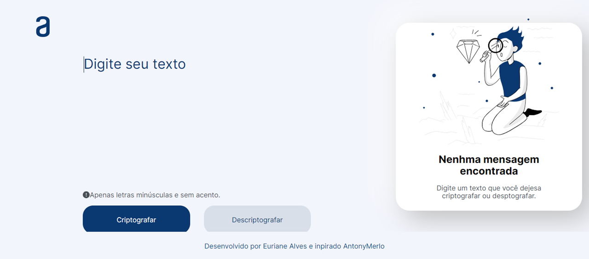
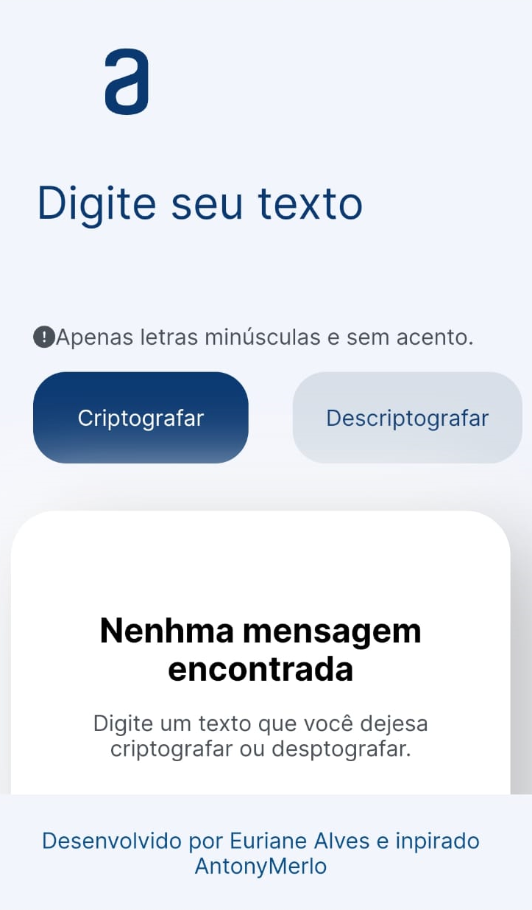

# Construindo um decodificador de texto simples

## Você vai conseguir criptografar e descriptografar testos para se divertir com sua família e amigos

### As "chaves" de criptografia que utilizada são:
- A letra "e" é convertida para "enter"
- A letra "i" é convertida para "imes"
- A letra "a" é convertida para "ai"
- A letra "o" é convertida para "ober"
- A letra "u" é convertida para "ufat"

## Tecnologias
### HTML
 

 ### CSS
 

 ### JS
 

 ## Responsividade em diferentes telas

 ### PC 
 

### Tablet

### Telefones móvel

Quero deixar aqui meu agradecimentos [AntonyMerlo](https://github.com/AntonyMerlo) que me ajudou muito nessa jornada. 